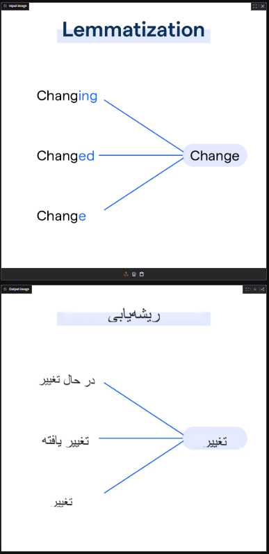
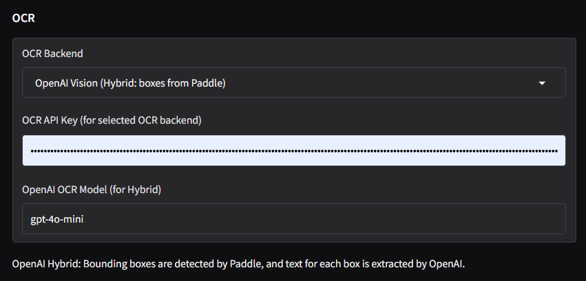

# Frame Text

A lightweight OCR → Translation → In-place Rendering app built with **Python + Gradio**.

---

## Course Context

This project was prepared for the course **"Topics in Computer Science"**.

**Instructor:** Dr. Aboozar Zandvakily

---

## About This Version

This is a **simple, early prototype (MVP)** developed in roughly **two half-days**.

It is intentionally minimal and focused on proving the core workflow:

1. Detect text from an input image (OCR)
2. Translate extracted text
3. Render translated text back into the original image regions

A lot of improvements are planned for future versions.

---

## Features

* Multiple OCR backends:

  * PaddleOCR (local)
  * Google Vision API
  * Azure Read API
  * OpenAI Vision (hybrid mode)
* Multiple translation providers:

  * OpenAI
  * DeepSeek
  * Gemini
  * Offline Argos Translate mode
* RTL-aware rendering support (e.g., Persian/Arabic)
* Dynamic text fitting inside detected text boxes
* Inpainting-based background cleanup before rendering translated text

---

## Screenshot


|                                                  |                                                  |
| ------------------------------------------------ | ------------------------------------------------ | 
|             |  |
|                                                  |  |
|                                                  |                                                  | 


---

## Quick Start

### 1) Clone repository

```bash
git clone [FrameText](https://github.com/Sobhan026/FrameText/)
cd FrameText
```

### 2) Create & activate virtual environment

```bash
python -m venv .venv
# Windows:
.venv\Scripts\activate
# macOS/Linux:
source .venv/bin/activate
```

### 3) Install dependencies

```bash
pip install -r requirements.txt
```

### 4) Run the app

```bash
python app.py
```

If localhost/proxy issues appear, you can run with:

```bat
set NO_PROXY=localhost,127.0.0.1
set no_proxy=localhost,127.0.0.1
python app.py
```

---

## Project Status

* ✅ Core pipeline implemented
* ✅ Functional Gradio interface
* ⚠️ MVP quality (not production-ready yet)
* 🚧 Significant refactoring and feature upgrades planned

---

## Planned Improvements

* Better OCR accuracy for noisy/low-resolution images
* Better typography and box-aware rendering quality
* Stronger error handling and retries for API providers
* Batch image processing and export options
* Cleaner architecture and module separation
* Packaging for desktop usage
* More tests and benchmarking

---

## Notes

This repository currently represents a **first working baseline**, created quickly for course delivery and experimentation. The goal is to iteratively improve quality, performance, and usability in next versions.

